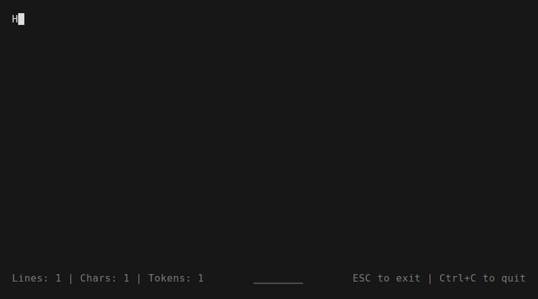

# Promptpad

Every AI terminal gives you the same thing: a small, cramped text box that makes writing
multi-line prompts a nightmare. You're writing complex instructions, detailed context,
multi-step plans, and you're doing it in an input field built for search queries.

Try Promptpad.

An extremely lightweight, full-screen terminal text editor designed for crafting AI
prompts. No bloat, no setup, it pops up instantly, lets you write freely, and saves
straight to your clipboard when you're done. Switch back to your AI tool and paste. No
tab juggling, no friction, just seamless context switching.



## Features

- Multiline text editing in the terminal
- Cursor navigation (arrows, Home/End, word jumping with Ctrl/Meta)
- Tab indentation
- Scrolling viewport
- Full-height terminal layout with status bar pinned to the bottom
- Live token count (using tiktoken, GPT-4 tokenizer)
- Line and character count
- Auto-copy to clipboard on exit

## Installation

```bash
npm install
npm link
```

This installs `ppd` as a global command. You can now launch Promptpad from anywhere:

```bash
ppd
```

- **Inside tmux**: opens as a tmux popup overlay
- **Outside tmux**: starts a new tmux session with the editor

When you exit (ESC or Ctrl+C), your text is copied to the clipboard automatically.

### Requirements

- Node.js
- tmux

### Installing tmux

Promptpad requires tmux to run. If you don't have it installed, follow the instructions for your platform:

**macOS** (Homebrew):

```bash
brew install tmux
```

**Ubuntu/Debian**:

```bash
sudo apt install tmux
```

**Fedora**:

```bash
sudo dnf install tmux
```

**Arch Linux**:

```bash
sudo pacman -S tmux
```

**Windows** (WSL):

Install via your WSL distribution's package manager (e.g. `apt install tmux`).

## Keybindings

| Key                    | Action                          |
| ---------------------- | ------------------------------- |
| Arrow keys             | Move cursor                     |
| Ctrl/Meta + Left/Right | Jump by word                    |
| Home / Ctrl+A          | Go to start of line             |
| End / Ctrl+E           | Go to end of line               |
| Tab                    | Insert 2-space indent           |
| Enter                  | New line                        |
| Backspace              | Delete character                |
| ESC / Ctrl+C           | Copy text to clipboard and exit |

## Tech Stack

A minimal terminal text editor built with [React Ink](https://github.com/vadimdemedes/ink).
